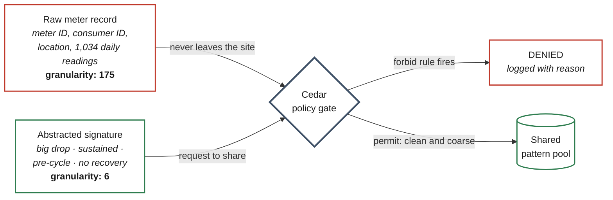
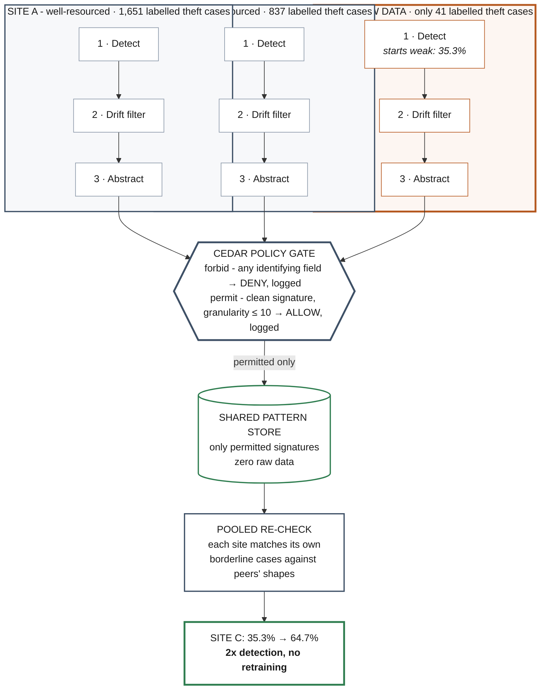
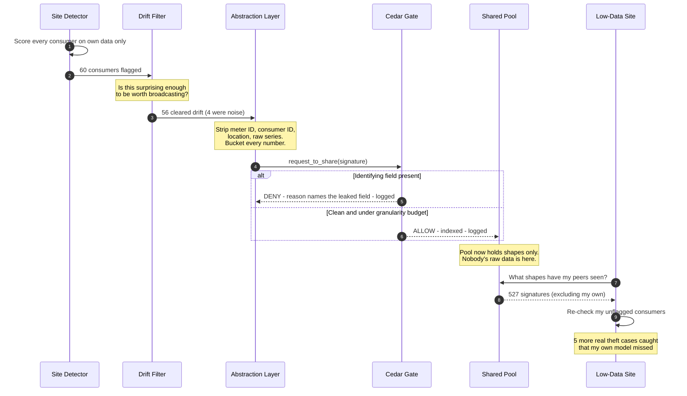

<div align="center">


<br/>

**Privacy-preserving theft-pattern sharing for India's power grid.**
A low-data utility catches **2x more theft** - without any utility ever seeing another's customer data.

<br/>

[](http://ec2-15-252-238-122.ap-south-1.compute.amazonaws.com/)

<br/>


</div>

---

## The 60-second version

> India loses **Rs 1.32 lakh crore a year** to electricity theft - about **2.4% of GDP**. The gap between the best- and worst-performing power utility runs to **45.8 percentage points**, and it isn't a skill gap. Small utilities simply haven't *seen* enough theft to learn what it looks like. The obvious fix - pool everyone's meter data - is legally impossible, because household consumption data exposes when you're home, how your business runs, what you earn.
>
> **TRIPWIRE lets utilities share the *shape* of a theft pattern instead of the data behind it** - and enforces that boundary with a real policy engine (AWS's Cedar), not a promise in a contract. A signature that still carries a meter ID is *mechanically blocked*, logged, and never leaves the building.
>
> The result, measured on **real, published, theft-labelled meter data from 42,372 consumers**: a low-data utility's detection rate goes from **35.3% to 64.7%**, trained on only **41** real theft cases of its own.

<div align="center">

### [**Run it live, right now**](http://ec2-15-252-238-122.ap-south-1.compute.amazonaws.com/)

*Nothing on that page is a recording. Every button re-runs the real pipeline.*

</div>

---

## Table of contents

| | Section | What's in it |
|---|---|---|
| 01 | [The problem](#01--the-problem-is-a-resource-gap-not-a-skill-gap) | Why small DISCOMs lose, with the real numbers |
| 02 | [The idea](#02--the-idea-move-the-shape-not-the-data) | Share the shape, never the data |
| 03 | [Architecture](#03--architecture) | The full system, diagrammed |
| 04 | [The intelligence layer](#04--the-intelligence-layer-seven-stages) | All seven stages, in order |
| 05 | [The Cedar boundary](#05--the-cedar-boundary-block-then-pass) | Block-then-pass, with the actual policy |
| 06 | [Results](#06--results) | Both datasets, both numbers, honest costs |
| 07 | [Tech stack](#07--tech-stack) | What's real, what's AWS, what's open |
| 08 | [Quick start](#08--quick-start) | Running it in three commands |
| 09 | [Engineering war stories](#09--engineering-war-stories) | The five things that broke, and the fixes |
| 10 | [Honest caveats](#10--honest-caveats) | What we're *not* claiming |
| 11 | [Research grounding](#11--research-grounding) | The papers this stands on |

---

## 01 · The problem is a resource gap, not a skill gap

### What it costs

| Metric | Value |
|---|---|
| Annual loss to electricity theft | **Rs 1.32 lakh crore** (~$16 billion) |
| Share of India's GDP | **2.4%** |
| National AT&C losses | 15.04% *(FY24-25, a record low)* |
| RDSS national target | 12-15% |
| Smart meters deployed under RDSS | 59.7 million |

### How unevenly it lands

| Utility | AT&C loss | Context |
|---|:-:|---|
| Adani Electricity | **4.46%** | achieved via 36,720 raids and 486 FIRs in one year |
| TPDDL (Delhi) | 5.91% | well-instrumented private operator |
| BRPL (Delhi) | 6.58% | well-instrumented private operator |
| National average | 15.04% | nearly half of all DISCOMs sit above this |
| **Best to worst spread** | **45.8 points** | **the gap this project exists to close** |

A big utility runs tens of thousands of raids a year and sees thousands of confirmed theft cases - so its models learn what theft looks like. A small or rural DISCOM might see a handful, ever. **You cannot learn a pattern from five examples.**

And the obvious fix is off the table:

```
  "Just pool everyone's consumption data."
    -> Household meter data reveals occupancy, business hours, income proxies.
    -> DISCOMs are separate legal entities with no shared regulatory pathway.
    -> DPDP Act (India), GDPR (EU), CCPA (US) all make this legally radioactive.
```

So every small utility re-learns the same lesson from scratch, forever, while the well-resourced ones pull further ahead.

---

## 02 · The idea: move the shape, not the data

> **"A sharp drop of about 60%, lasting roughly two weeks, starting just before the billing boundary, that never recovered."**

That sentence is genuinely useful to another utility's detector. It also says **nothing** about who it happened to, where they live, or what their meter reads. That's a *signature* - and signatures are the only thing TRIPWIRE ever lets cross a site boundary.

The critical part is the word **lets**. This isn't a data-handling policy someone signed. It's [Cedar](https://www.cedarpolicy.com/) - AWS's open-source authorization engine, the same one that powers **Amazon Verified Permissions** in production - sitting in the path of every single share request, returning `ALLOW` or `DENY`, logging both.



---

## 03 · Architecture

Three independent sites. No central brain. No site ever talks to another site directly - they leave traces in a shared environment and read them independently. *(Biologists call this **stigmergy** - it's how ant colonies coordinate without a queen giving orders.)*



<details>
<summary><b>See the same flow as a step-by-step sequence</b></summary>

<br/>



</details>

---

## 04 · The intelligence layer: seven stages

Drift is only one filter among several. Here is every stage, in the order it actually executes:

| # | Stage | What it does | Code |
|:-:|---|---|---|
| **1** | **Detect** | Per-site model scores every consumer using *only that site's own history*. `IsolationForest` (unsupervised path) or `RandomForestClassifier` trained on real labels (real-data path). | `detection/detector.py`<br/>`detection/real_detector.py` |
| **2** | **Feature engineering** | 1,034 raw daily readings become 4 meaningful signals: **drop magnitude**, **duration**, **recovery shape**, **volatility**. | `detection/features.py`<br/>`detection/real_features.py` |
| **3** | **Drift trigger** | The "surprise" threshold. A drop must be **both large and sustained** to become a sharing candidate. Without this, a detector's own false positives poison the pool. | `detection/drift.py` |
| **4** | **Abstract** | Precise values become deliberately coarse buckets. Every identifying field stripped. Output is a `Signature`, plus a `granularity` score measuring how much detail survived. | `policy/signature.py` |
| **5** | **Cedar gate** | The boundary. `forbid` on any identifying field - **unconditionally**. `permit` only a clean signature under the granularity budget. Every verdict logged. | `policy/gate.py`<br/>`policy/policies/sharing.cedar` |
| **6** | **Shared pool** | Permitted signatures land in a store every site can read. Pooled knowledge, zero raw data, no model retraining anywhere. | `shared_store/store.py` |
| **7** | **Pooled re-check** | A site matches its own *borderline* cases against peers' shapes. This is how a low-data site borrows experience it never had. | `detection/pooled_recheck.py` |
| **+** | **Real agent orchestration** | A genuine `strands.Agent` - backed by a real LLM doing real tool-calling - can drive stages 1-7 by *deciding* which tool to invoke, instead of following a fixed script. | `orchestration/strands_agent.py` |

---

## 05 · The Cedar boundary: block-then-pass

The entire privacy claim rests on this file. It is 2 rules, about 20 lines, and it is the reason the guarantee is checkable by someone who doesn't trust our code:

```cedar
// Rule 1 - an identifying field is an UNCONDITIONAL deny.
// In Cedar, `forbid` always beats `permit`, regardless of rule order or
// anything added later. This leak cannot be reopened by accident.
forbid (
    principal,
    action == Action::"share",
    resource
) when {
    resource.has_meter_id ||
    resource.has_consumer_id ||
    resource.has_raw_series ||
    resource.has_household_field ||
    resource.has_location
};

// Rule 2 - a clean signature may share, only if it is also coarse enough.
// Catches payloads that name no identifier but are still too fine-grained
// to be safe to pool (e.g. an un-bucketed raw score).
permit (
    principal,
    action == Action::"share",
    resource
) when {
    resource.kind == "signature" &&
    resource.granularity <= 10
};
```

**Cedar is handed seven fields. That's all it ever sees.** Not a load-shape value, not a bucket label - just `kind`, five `has_*` booleans, and a `granularity` integer. The richer signature content never enters the authorization decision, by design.

### The proof, on screen, in three requests

| # | What's submitted | Granularity | Verdict | Why it matters |
|:-:|---|:-:|:-:|---|
| 1 | Raw meter record, untouched | `175` | **DENY** | Fails safe by default - raw data is *never* allowed through |
| 2 | Signature, but a bug left the meter ID attached | `31` | **DENY** | Catches **partial** mistakes, and names the exact leaked field |
| 3 | Signature, properly abstracted | `6` | **ALLOW** | It's a gate, not a wall - safe knowledge really does get through |

```
[DENY ] site_c_low_data -> raw-22d999d1a86c   (kind=raw_record, granularity=175)  matched=policy0
  reason: identifying field(s) present: has_meter_id, has_consumer_id, has_raw_series,
          has_household_field, has_location

[DENY ] site_c_low_data -> sig-0c15d97664d6   (kind=signature,  granularity=31)   matched=policy0
  reason: identifying field(s) present: has_meter_id
  >>> BLOCKED ON SCREEN - this signature does not leave the site.

[ALLOW] site_c_low_data -> sig-41263545d40a   (kind=signature,  granularity=6)    matched=policy1
  reason: signature is clean and within the granularity threshold
  >>> PASSED - eligible for the shared pattern store.
```

Every decision - allow *and* deny - is appended to an inspectable JSONL audit log. **The log itself never stores a raw identifier value**, only the coarse flags Cedar saw. A denial is fully explainable after the fact without the log becoming a second place a meter ID could leak from.

---

## 06 · Results

### On real, published data - 42,372 real consumers

The **SGCC Electricity Theft Detection Dataset** (State Grid Corporation of China, via Zheng et al., IEEE): real smart-meter readings, 1,034 days each (2014-01-01 to 2016-10-31), with **real confirmed theft labels**. Not a simulation.

<div align="center">

| Site | Labelled theft cases to train on | Isolated | **Pooled** | Change |
|---|:-:|:-:|:-:|:-:|
| Site A | 1,651 | 57.2% | - | *contributes to pool* |
| Site B | 837 | 54.5% | - | *contributes to pool* |
| **Site C (low data)** | **41** | **35.3%** | **64.7%** | **+29.4 pts** |

**6/17 to 11/17 real theft cases caught.** No retraining. No extra local data. No peer's customer data ever seen.

</div>

> **The honest cost, stated plainly:** precision drops from 26.1% to 20.4%, false-positive rate rises from 10.4% to 26.4%. Real, noisy data does not offer a free lunch - pooling buys recall and pays in precision. We report both numbers together on purpose, because a detection-rate gain that quietly hides a worse false-positive problem is worthless. This is the more credible of our two numbers precisely *because* it isn't free.

### On the synthetic path - clean, deterministic, about 1 second

Built first (before the Kaggle dataset was available), kept because it's fast and deterministic enough to be a live, clickable demo:

<div align="center">

| Site | Isolated | **Pooled** | Change | Added false positives |
|---|:-:|:-:|:-:|:-:|
| Site A | 93.3% | **100%** | +6.7 pts | 0 |
| Site B | 97.2% | **100%** | +2.8 pts | 0 |
| **Site C (low data)** | **33.3%** | **66.7%** | **+33.3 pts** | **0** |

</div>

Note that **every** site improves - including the well-resourced ones. That's the swarm effect working as designed, not a result tuned for one site.

### Validated across 8 independent random seeds

One good run proves nothing. The live demo re-runs the entire pipeline **8 times** with 8 different randomly-generated populations and reports mean / min / max improvement - plus the question that actually matters: *did pooling ever make false positives worse, in any run?*

<div align="center">


</div>

Every test runs against the **real** Cedar engine, the **real** scikit-learn models, and (where the dataset is present) the **real** SGCC data. Nothing in the result path is mocked.

---

## 07 · Tech stack

<div align="center">

| Layer | Technology | Why this one |
|---|---|---|
| **Policy** | **Cedar** (`cedarpy`) | AWS's own authorization language - the engine behind **Amazon Verified Permissions**. Policies are independently *analyzable*, which is why AWS trusts it for production IAM decisions. Remove it and the project has no privacy boundary at all. |
| **Agents** | **Strands Agents SDK** | AWS's open-source agentic framework. Model-agnostic - runs against Bedrock, or (here, with no cloud credentials available) a fully local Ollama model. |
| **LLM** | `qwen2.5:1.5b` via **Ollama** | Free, offline, about 1 GB. Real tool-calling, no API key, no spend. Swapping to Bedrock is a one-line `model=` change. |
| **Shared store** | **OpenSearch** (`opensearch-py`) | AWS's open-source search and analytics engine. Written against the real client; see [caveats](#10--honest-caveats) for cluster status. |
| **Detection** | **scikit-learn** | `IsolationForest` (unsupervised path), `RandomForestClassifier` (real-data path, AUC approx. 0.76) |
| **Backend** | **FastAPI** + Uvicorn | Two endpoints, both re-running the genuine pipeline per request - no pre-recorded responses |
| **Frontend** | **React 19** · Vite · Tailwind 4 · Framer Motion · GSAP · Lenis | The live site, including the interactive "See It Work" section |
| **Hosting** | **AWS EC2** · `ap-south-1` | Mumbai region - the same country the problem is about |
| **Testing** | **pytest** | 149 tests, real engines throughout |

</div>

### Repository layout

```
tripwire/
├── policy/                      THE BOUNDARY  (Person 2)
│   ├── signature.py                 anomaly -> abstracted signature, identifiers stripped
│   ├── gate.py                      PolicyGate: real Cedar authorization + logging
│   ├── decision_log.py              append-only JSONL audit trail + query/summarize
│   └── policies/
│       ├── sharing.cedar            the two rules the whole claim rests on
│       └── sharing.cedarschema      Cedar entity/action schema
│
├── detection/                   THE DETECTORS  (Person 1)
│   ├── dataset.py                   synthetic SGCC-style sites, uneven volume
│   ├── detector.py                  per-site IsolationForest
│   ├── drift.py                     the "surprise" trigger before sharing
│   ├── features.py                  shape feature engineering
│   ├── baseline.py                  detection_rate / precision / false_positive_rate
│   ├── pooled_recheck.py            match unflagged consumers against the pool
│   ├── real_dataset.py              loads the REAL SGCC CSV, splits into 3 uneven sites
│   ├── real_features.py             real-data features (spurious zeros, 1,034-day scale)
│   ├── real_detector.py             supervised RandomForestClassifier
│   └── real_pipeline.py             real-data detect -> gate -> pool -> re-check
│
├── orchestration/               THE SWARM  (Person 3)
│   ├── agent.py                     SiteAgent - one substation's full loop
│   ├── loop.py                      run_swarm_cycle - every site, one shared pool
│   └── strands_agent.py             the same cycle, driven by a real LLM agent
│
├── shared_store/                THE POOL
│   └── store.py                     PatternStore · LocalPatternStore · OpenSearchPatternStore
│
├── scripts/                     RUNNABLE PROOFS
│   ├── demo_block_then_pass.py      the on-screen DENY -> DENY -> ALLOW proof
│   ├── run_isolated_vs_pooled.py    the measured result, synthetic data
│   ├── run_real_sgcc_pipeline.py    the measured result, REAL SGCC data
│   ├── run_strands_swarm.py         the same cycle, real LLM orchestration
│   └── inspect_log.py               decision-log CLI
│
├── tests/                       149 tests, real engines, zero mocks in the result path
├── server.py                    FastAPI backend behind the live site
└── ui/                          React 19 + Vite pitch site and live runner
```

---

## 08 · Quick start

```bash
git clone https://github.com/Raginipawar/FirstCommit_.git
cd FirstCommit_
pip install -r requirements.txt
```

**The core proofs - no extra setup, runs in seconds:**

```bash
# The block-then-pass proof: raw DENY -> leaky DENY -> clean ALLOW
python scripts/demo_block_then_pass.py

# The measured result on synthetic data (~1s)
python scripts/run_isolated_vs_pooled.py

# Read back every Cedar decision that was logged
python scripts/inspect_log.py

# The whole suite - 149 tests, real engines
pytest tests/ -v
```

**The heavier paths - real data and real LLM orchestration:**

```bash
# The REAL SGCC dataset (download from Kaggle first - see data/README.md)
python scripts/run_real_sgcc_pipeline.py "path/to/data set.csv"

# The same swarm cycle, driven by a real Strands agent + local LLM
ollama pull qwen2.5:1.5b
python scripts/run_strands_swarm.py
```

> Real-data tests **skip gracefully** rather than failing if the 163 MB CSV isn't present - set `TRIPWIRE_SGCC_CSV` to its path to enable them.

---

## 09 · Engineering war stories

> The parts that broke, why they broke, and what actually fixed them. We think these matter more than the parts that worked first try.

<details>
<summary><b>#1 - We poisoned our own shared pool (and precision fell to single digits)</b></summary>

<br/>

**What we built first:** every anomaly the detector flagged got abstracted and shared. Simple, obvious, wrong.

**What broke:** `IsolationForest`'s `contamination` parameter forces it to flag a fixed *proportion* of consumers - so it always flags something, including false positives. And a false positive's signature looks almost exactly like an ordinary customer's mildest natural variation. Once one of those entered the pool, it matched the **majority of a peer site's honest customers**. Recall went up to 100% - and precision cratered to **6.7%**, with a **100% false-positive rate**. The "improvement" was flagging nearly everyone.

**The fix:** `detection/drift.py`. Before a flagged anomaly can become a *sharing candidate*, it must independently clear absolute thresholds on the actual shape - a drop must be **both large and sustained** - regardless of where the forest ranked it. Empirically, on every synthetic site, **every true positive clears these thresholds and every observed false positive does not.** Pinned by `tests/test_drift.py`.

**The kicker:** this mechanism was already described in our own planning doc as "the drift trigger." It was missing from the first *implementation*, not from the design. We found it by watching the numbers get absurd, not by re-reading our own spec.

</details>

<details>
<summary><b>#2 - The real dataset broke our detector completely</b></summary>

<br/>

**The assumption:** the approach that worked on synthetic data would transfer to the real SGCC data with minor tuning.

**What actually happened:** unsupervised anomaly detection on the real data scored **barely above chance**. Best trade-off found across several variations: about 59% recall at a 44% false-positive rate. We also tried feeding the full time series in, and noise-corrected variants. No better.

**Why - and this is the important part:** this is not a tuning failure. This exact dataset is documented in the literature as requiring more than simple anomaly detection - the original Zheng et al. paper builds a **Wide & Deep CNN** specifically *because* naive methods don't separate well on it. Our synthetic data was separable because we controlled how the theft signal was injected. Real data owes us nothing.

**The fix:** the project brief explicitly allowed *"isolation forest **or** a lightweight classifier."* Since real labels exist, we trained a **supervised** `RandomForestClassifier` - exactly what a real DISCOM would do with its own confirmed theft history. Result: a genuine, literature-consistent **AUC of about 0.76**.

**The bonus:** this gave "low-data site" a far more honest meaning. It's no longer "we deliberately miscalibrated a parameter" - it's *"this site has only 41 confirmed theft cases to learn from, so it cannot train as good a model as a site with 1,651."* That is the problem statement, stated literally.

</details>

<details>
<summary><b>#3 - Real meters lie about zero (and honest customers lie more)</b></summary>

<br/>

**The discovery:** about **13.2%** of all real SGCC readings are recorded as exactly `0.0`. Our "trough = minimum reading" feature was getting swamped - median drop magnitude came out at `1.0` for theft **and** honest customers alike. Zero signal.

**The tell that cracked it:** we checked the zero-rate by label.

| | Mean fraction of days recorded as exactly `0.0` |
|---|:-:|
| Honest customers | **13.7%** |
| Theft customers | 8.3% |

Honest customers have *more* zeros. These are meter and recording glitches, not theft signal - so any feature keying on them is actively misleading.

**The fix:** `declutter_zeros()` treats short zero-runs (2 days or fewer) as missing data and interpolates them - while **preserving** long sustained zero runs, because a genuinely bypassed meter reading zero for weeks is exactly the pattern we *want* to catch. Distinguishing the glitch from the signal, rather than discarding both.

</details>

<details>
<summary><b>#4 - 96 seconds to 19 seconds, without changing a single result</b></summary>

<br/>

**The problem:** the first correct implementation of `declutter_zeros()` used a pandas `groupby` per consumer. Correct, tested, and - across all 42,372 real consumers - **about 96 seconds end to end.** Far too slow for a button a judge clicks live.

**The fix:** rewrote the run-length detection as pure vectorized NumPy boundary arithmetic, plus a manual forward/back fill via `maximum.accumulate` and `minimum.accumulate` index tricks instead of pandas.

**The result:** **about 19 seconds. Roughly 5x faster. Byte-identical output**, verified by the same test suite and by diffing the full pipeline's printed numbers before and after.

</details>

<details>
<summary><b>#5 - Making a 1.5B local model do real agentic tool-calling</b></summary>

<br/>

No Bedrock credentials, no Anthropic key - so the Strands agent runs against a local Ollama model. Getting that to *genuinely work* (not just be wired up) surfaced three real limits, each fixed **in the code** rather than papered over with a better prompt:

1. **`llama3.2:1b` couldn't emit real tool calls at all** - it would print tool-call-shaped JSON as plain text, which Strands has no way to execute. Swapped for **`qwen2.5:1.5b`**, which has explicit tool-use training.

2. **The model sometimes called a tool twice for the same site** (observed: 6 calls for 3 sites). `share_round()` isn't safe to run twice - it would re-index duplicate signatures and inflate the pool. Fixed by making **the tools themselves idempotent**, so a model quirk cannot distort real state. *The fix belongs in the code, not the prompt.*

3. **Two-phase orchestration on one `Agent` was unreliable** whenever #2 fired, because the cluttered history confused the second turn. Fixed by giving each phase **its own fresh `Agent`** - all real state lives in Python closures, so correctness never depends on the LLM remembering anything.

**Result:** 6 of 6 single-attempt successes across two test batches, reproducing the *exact* same 33.3% to 66.7% as the deterministic loop. A `max_attempts=5` retry stays in the code anyway - a small local model doing agentic tool-calling doesn't earn blind faith just because recent runs looked clean.

</details>

---

## 10 · Honest caveats

> Stated up front, before anyone has to ask. We'd rather be the team that told you than the team that got caught.

| Claim | Status | Reality |
|---|:-:|---|
| **Live OpenSearch cluster** | **Not live** | `OpenSearchPatternStore` is written against the real `opensearch-py` client, but has never connected to an actual cluster. We *tried* - Docker Desktop's daemon won't start on this machine because the Windows install is itself inside a hypervisor with no nested virtualization exposed. A host-level blocker, not an unattempted task. `LocalPatternStore` (JSONL, same interface) is the tested, working path. Swapping is **one line**. |
| **Strands agent in the live demo** | **Built, not wired** | `scripts/run_strands_swarm.py` reproduces the identical result via genuine LLM tool-calling. It is *not* what `server.py` calls, on purpose: an LLM loop is slower and less deterministic than a function call, which is the wrong trade for a button a judge clicks. |
| **"Real data"** | **Real** | The SGCC dataset is genuinely real (42,372 real consumers, real labels). The live website button runs the *synthetic* path because it's about 1s instead of about 19s. Both are real, tested code; neither is disguised as the other. |
| **Privacy guarantee** | **Real, not formal** | Abstraction plus policy enforcement substantially reduces identifiability. It is **not** differential privacy, and we don't claim a mathematical bound. Re-identification attacks against aggregated statistics do exist. DP on the signatures themselves, with a measured privacy-accuracy curve, is the documented next step. |
| **Site split** | **Fabricated partition** | The three "utilities" are a fabricated partition of one real population - the consumers, readings and theft labels are real; which site each belongs to is ours. |

---

## 11 · Research grounding

| Source | What we took from it |
|---|---|
| **Zheng, Yang, Niu, Dai, Zhou** - *"Wide and Deep CNN for Electricity-Theft Detection to Secure Smart Grids"*, IEEE Trans. Industrial Informatics | The SGCC dataset itself (42,372 consumers, 1,035 days), and the evidence that naive methods underperform on it |
| **Kulkarni et al.** - *EnsembleNTLDetect*, [arXiv:2110.04502](https://arxiv.org/abs/2110.04502) | Pre-processing and evaluation framing for non-technical-loss detection |
| **Finardi et al.** - *Electricity Theft Detection with Self-Attention*, [arXiv:2002.06219](https://arxiv.org/pdf/2002.06219) | Sequence-model baseline reference |
| **Google Research** - *Titans* | Framing for the shared store: test-time memory, no retraining required |
| **AWS** - [Cedar](https://www.cedarpolicy.com/) | The authorization engine, and the `forbid`-beats-`permit` guarantee our whole boundary rests on |

---

<div align="center">

### Team Saturn

**First Commit Hackathon** · Bharat Builds Tour Stop 01
Polaris School of Technology, Bengaluru · 17-20 September 2026

<br/>

> *"Three sites. One shared memory. Zero raw records shared."*
>
> **The privacy boundary is code. Not a promise.**

<br/>

[](http://ec2-15-252-238-122.ap-south-1.compute.amazonaws.com/)


</div>
